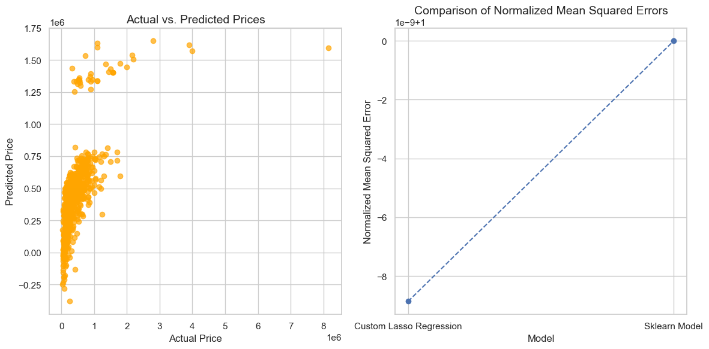

# Custom Lasso Regression Model for Price Prediction

This repository contains a Python implementation of a custom Lasso regression model used for predicting car prices based on various features.
The dataset utilized includes car attributes such as fuel type, seller type, transmission type, and owner details.

This project aims to compare a custom implementation of Lasso regression with the Scikit-Learn library's Lasso model.
It demonstrates data preprocessing, outlier detection, feature scaling, model training, and evaluation using Mean Squared Error (MSE) as the performance metric.

The dataset used in this project is named cardetails_csv.csv. It contains various features related to car details and their respective selling prices.

The code generates plots showing-

#### 1. The relationship between actual and predicted prices

#### 2. A comparison of normalized mean squared errors for the custom Lasso regression model and the Scikit-Learn model

These visualizations help in understanding the model performance.
